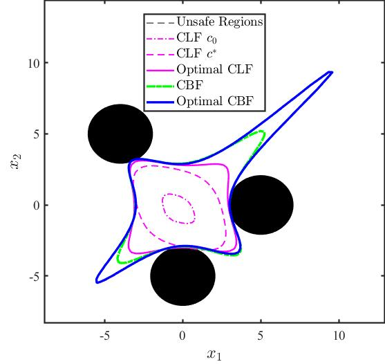
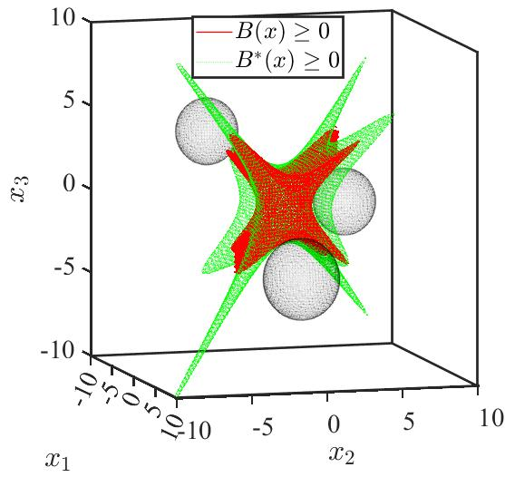
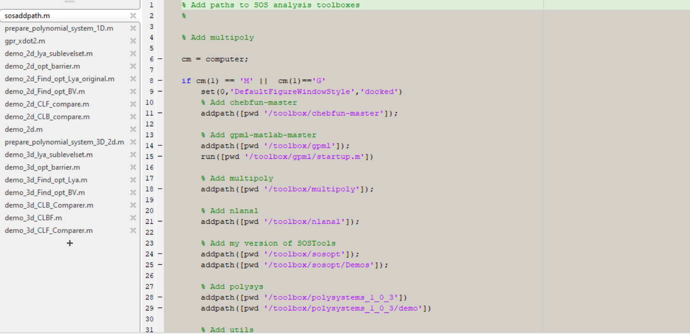

# ASCC2022: GP+SOSP+Polynomial Controller
Consider a control affine dynamical system as follows,
$$
\dot{x} = f(x)+g(x)u+d(x),
$$
where $x \in \mathcal{X} \subset \mathbb{R}^{n}$ and $u \in \mathcal{U} \subset \mathbb{R}^{m}$ denote the state and control of the system. The system is consisted of three Lipschitz continuous terms, $f:\mathbb{R}^{n}\rightarrow \mathbb{R}^{n}$ denotes a nonlinear term, $g:\mathbb{R}^{n}\rightarrow \mathbb{R}^{n\times m}$ denotes a polynomial term and $d:\mathbb{R}^{n}\rightarrow \mathbb{R}^{n}$ denotes an unknown term. We consider a polynomial control input $u$ over the stabilization process in this paper.

In this repo, we use

- Chebfun Toolbox: To approximate nonlinear terms by Chebyshev Interpolants,
- GPML Toolbox: Expressed the Gaussian processes mean function of this unknown term $d(x)$ into the polynomial form,
- SOSOPT+Mosek: To solve some sum-of-squares programmings in this learned polynomial system.

Note that, please run *sosaddpath.m* at the beginning and Do not forget to install the Mosek Solver in advance.

The final ROA with polynomial controller of the 2D system is:

The final ROA of the 3D demo:

The related files are concluded in the figure below

To verify the **2D demo**, please  run these files in a sequent.

- prepare_polynomial_system_1D.m
- demo_2d_lya_sublevelset.m
- demo_2d_opt_barrier.m
- demo_2d_Find_opt_Lya_original.m
- demo_2d_Find_opt_BV.m
- demo_2d_CLF_compare.m
- demo_2d_CLB_compare.m

To verify the **3D demo**, please  run these files in a sequent.

- prepare_polynomial_system_3D_2d.m
- demo_3d_lya_sublevelset.m
- demo_3d_opt_barrier.m
- demo_3d_Find_opt_Lya.m
- demo_3d_Find_opt_BV.m
- demo_3d_CLB_Comparer.m
- demo_3d_CLF_Comparer.m
- demo_3d_CLBF.m

Feel free to contact `hejunhuang@cuhk.edu.hk` for more details.
