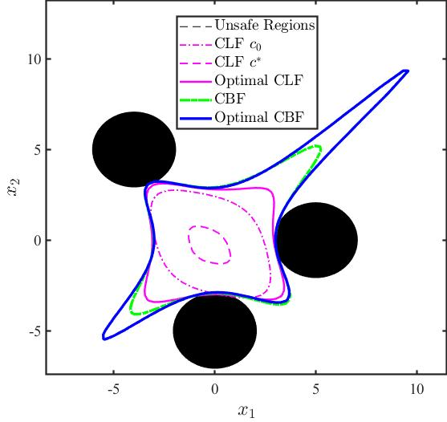
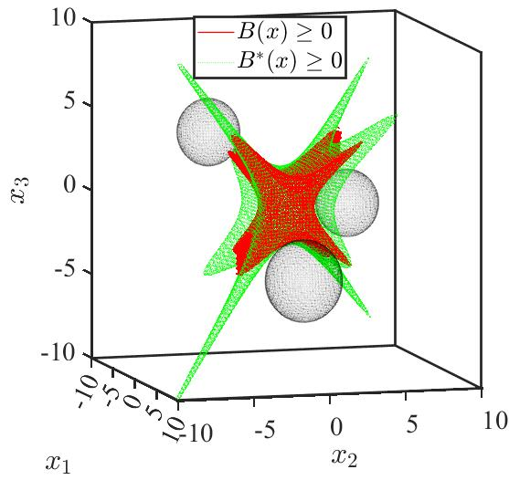

# ASCC2022
Consider a control affine dynamical system as follows,
$$dot{x} = f(x)+g(x)u+d(x),$$
where $x \in \mathcal{X} \subset \mathbb{R}^{n}$ and $u \in \mathcal{U} \subset \mathbb{R}^{m}$ denote the state and control of the system. The system is consisted of three Lipschitz continuous terms, $f:\mathbb{R}^{n}\rightarrow \mathbb{R}^{n}$ denotes a nonlinear term, $g:\mathbb{R}^{n}\rightarrow \mathbb{R}^{n\times m}$ denotes a polynomial term and $d:\mathbb{R}^{n}\rightarrow \mathbb{R}^{n}$ denotes an unknown term. We consider a polynomial control input $u$ over the stabilization process in this paper.

In this repo, we use

- Chebfun Toolbox: To approximate nonlinear terms by Chebyshev Interpolants,
- GPML Toolbox: Expressed the Gaussian processes mean function of this unknown term $d(x)$ into the polynomial form,
- SOSOPT+Mosek: To solve some sum-of-squares programmings in this learned polynomial system.

Note that, please run *sosaddpath.m* at the beginning and Do not forget to install the Mosek Solver in advance.

The final ROA with polynomial controller of the 2D system is:
$$
\begin{eqnarray}
\begin{aligned}
\begin{bmatrix} \dot{x}_1 \\ \dot{x}_2 \end{bmatrix} = 
\begin{bmatrix}
-x_{1}+x_{2}+u_1\\	x_{1}^{2}x_{2}+1-\sqrt{\vert\exp(x_1)\cos(x_1)\vert}+u_2+d(x)
\end{bmatrix},
\end{aligned}
\end{eqnarray}
$$

The final ROA of the 3D demo:
$$
\begin{eqnarray}
\begin{aligned}
\begin{bmatrix} \dot{x}_1 \\ \dot{x}_2\\\dot{x}_3 \end{bmatrix} = 
\begin{bmatrix}
-x_{1}^2-\cos{(x_{1}^2)}\sin{(x_{1})}+u_1(x)+d_1(x)\\	
-x_{2}-x_{1}^3x_{2}+u_2(x)\\
-x_{1}^2x_{3}+1-\sqrt{|\exp{(x_{1})}\cos{(x_{1})}}+u_3(x)+d_3(x)
\end{bmatrix}.
\end{aligned}   
\end{eqnarray}
$$

Feel free to contact `hejunhuang@cuhk.edu.hk` for more details.
